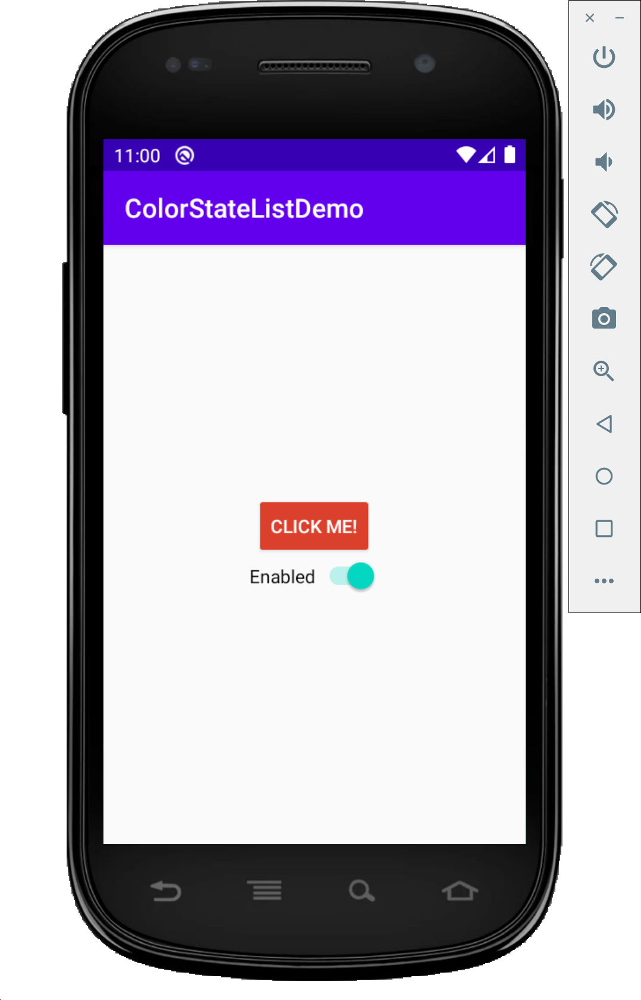

# ColorStateListDemo

This repository contains example code to change the background color of a button in Android Studio. We use a ColorStateList resource so we can control the UI of the button as it enters various states (enabled, selected, pressed).
